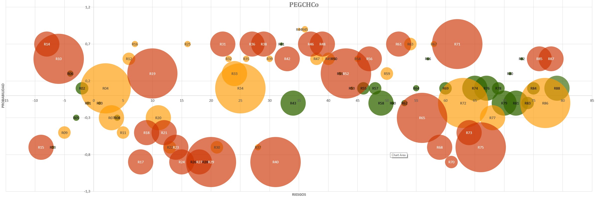

# ADN de Riesgos · Matriz DAFO

**Aplicación Streamlit para evaluar y visualizar factores DAFO (Debilidades, Amenazas, Fortalezas, Oportunidades) como una matriz de riesgo cualitativa, con exportación para documentos de planificación urbanística.**


---



## Objetivo: convertir un DAFO en una matriz de riesgo.

Un DAFO clásico enumera debilidades, amenazas, fortalezas y oportunidades en forma de texto, perdiendo información esencial. Es imposible conover cuáles son prioritarios: un factor puede tener un impacto muy alto y aun así representar un riesgo bajo, simplemente porque es poco probable que ocurra.

Este proyecto traduce cada factor en tres variables comparables:

- **Naturaleza (eje X)** — sistemático (ajeno al ámbito, ej. tendencias demográficas generales) frente a específico (propio del ámbito estudiado).
- **Probabilidad de ocurrencia (eje Y)** — de muy baja a muy alta, con signo según si el factor es negativo (amenaza/debilidad) o positivo (oportunidad/fortaleza).
- **Impacto (tamaño del círculo)** — de muy bajo a muy alto.

El **nivel de riesgo** (bajo / moderado / alto) no es una media simple de probabilidad e impacto: se calcula con una matriz cualitativa **asimétrica**, que penaliza las amenazas frente a las oportunidades de igual magnitud. Un impacto "muy alto" con probabilidad "media" puede ser riesgo **alto** si es una amenaza, pero solo **moderado** si es una oportunidad equivalente — la matriz completa está documentada en `00_DAFO_RISK.md`.

La aplicación permite cargar ficheros tipo excel de indicadores ya existentes (o introducirlos manualmente), calcula automáticamente DAFO/valor/nivel/color para cada fila, y genera dos salidas: un gráfico interactivo para explorar en pantalla y una figura vectorial (PDF/SVG/PNG) lista para imprenta.

## Características

- **Clasificación automática en DAFO** — a partir de `SIST/ESPEC` (sistemático/específico) y `TIPO` (negativo/positivo), cada fila se etiqueta como AMENAZA, DEBILIDAD, OPORTUNIDAD o FORTALEZA.
- **Matriz de riesgo asimétrica** — implementada como tabla de consulta `(probabilidad, impacto con signo) → nivel`, fiel a la matriz cualitativa oficial (penaliza amenazas frente a oportunidades).
- **Importación flexible** — acepta el esquema limpio de 9 columnas o los ficheros tipo excel legados con hoja `TABLA` (detecta cabeceras por alias: `INDICADOR`/`FACTOR` → `RIESGO`, `SIST`→`SIST/ESPEC`, etc.) y CSV con separador `;` o `,` autodetectado.
- **Asignación automática del eje X** — los factores sistemáticos reciben índices negativos y los específicos positivos, conservando el mismo valor de X para un mismo código a través de distintos periodos.
- **Modo comparación temporal** — superpone varios periodos (`Año 1`, `Año 2`…) y traza la trayectoria de cada indicador entre ellos.
- **Gráfico interactivo (Plotly)** — burbujas con tamaño proporcional al impacto, tooltips con el detalle completo del factor, zoom y tema oscuro.
- **Exportación editorial (Matplotlib)** — PDF/SVG vectorial o PNG a 300 dpi, con fondo claro (imprenta) u oscuro (pantalla/proyección), título opcional.
- **Edición en tabla en vivo** — `st.data_editor` con validación por columna (selectboxes para naturaleza, signo, probabilidad, impacto); los cálculos se refrescan al instante.
- **Índice agregado del ámbito** — media de riesgos negativos, media de positivos, índice global e indicadores en riesgo alto, por periodo.
- **Exportación de la tabla calculada** — CSV con separador `;` y decimal `,`, listo para ficheros tipo excel en español.

## Requisitos previos

| Requisito | Notas |
|-----------|-------|
| Python 3.9+ | Con `pip` disponible. |
| Conda (opcional pero recomendado) | Para aislar el entorno; los pasos de instalación usan `conda`, pero un `venv` estándar funciona igual. |
| Paquetes | `streamlit`, `pandas`, `plotly`, `matplotlib`, `openpyxl` (se instalan en un solo paso). |

## Instalación y ejecución

### Linux / macOS

```bash
conda activate
pip install streamlit pandas plotly matplotlib openpyxl
streamlit run app_dafo_riesgos.py
conda deactivate
```

### Windows

Desde el **Anaconda Prompt** (o cualquier terminal con `conda` en el PATH):

```bat
conda activate
pip install streamlit pandas plotly matplotlib openpyxl
streamlit run app_dafo_riesgos.py
conda deactivate
```

> Si no usas Conda, sustituye las dos primeras líneas por un entorno virtual estándar:
>
> ```bash
> python -m venv .venv
> # Linux/macOS
> source .venv/bin/activate
> # Windows (PowerShell)
> .venv\Scripts\Activate.ps1
>
> pip install streamlit pandas plotly matplotlib openpyxl
> streamlit run app_dafo_riesgos.py
> ```

En cualquier sistema, tras ejecutar `streamlit run`, la aplicación se abre automáticamente en `http://localhost:8501`.

### Tema oscuro persistente (opcional)

Para fijar el modo oscuro con independencia del sistema operativo, crea `.streamlit/config.toml` junto al script:

```toml
[theme]
base = "dark"
primaryColor = "#c2544c"
backgroundColor = "#111317"
secondaryBackgroundColor = "#1b1e24"
textColor = "#e6e2da"
```

## Uso

| Paso | Qué hace |
|------|----------|
| **1 — Arranque** | Al iniciar, la app carga datos de demostración (10 indicadores de ejemplo en dos periodos). |
| **2 — Importar datos** | En la barra lateral, sube un fichero (`.xlsx`/`.xls`) o CSV con el esquema de 9 columnas, o un Excel legado con hoja `TABLA`. Indica el periodo por defecto si el fichero no lo trae. |
| **3 — Elegir periodo o comparar** | Selecciona un periodo único, o activa **Modo comparación** para superponer varios y ver la trayectoria de cada indicador. |
| **4 — Revisar el índice agregado** | Consulta la media de riesgos negativos/positivos, el índice global y el nº de indicadores en riesgo alto. |
| **5 — Explorar el gráfico** | El gráfico Plotly admite zoom y tooltips con el detalle de cada factor (código, riesgo, dato, comentario, nivel…). |
| **6 — Exportar para documento** | Elige formato (`PDF`/`SVG`/`PNG`), fondo (claro/oscuro) y título opcional; descarga la figura vectorial de calidad editorial. |
| **7 — Añadir un indicador** | Despliega **➕ Añadir indicador**, rellena código, naturaleza, signo, probabilidad e impacto; la vista previa muestra el DAFO y el nivel de riesgo antes de confirmar. |
| **8 — Editar la tabla** | La tabla de indicadores es editable célula a célula; añade filas con «+» o elimínalas con Supr. Los cálculos se actualizan al instante. |
| **9 — Exportar la tabla** | Desde **Tabla calculada**, descarga un CSV con todas las columnas derivadas (`DAFO`, `VALOR`, `NIVEL`…). |

### Esquema de datos de entrada

Columnas del esquema limpio (9 + código):

```
CODIGO | RIESGO | DATO | COMENTARIO | SIST/ESPEC | TIPO | PROBABILIDAD | IMPACTO | PERIODO | X
```

- `SIST/ESPEC`: `SISTEMATICO` o `ESPECIFICO`.
- `TIPO`: `NEGATIVO` o `POSITIVO`.
- `PROBABILIDAD`: `MUY BAJA` · `BAJA` · `MEDIA` · `ALTA` · `MUY ALTA`.
- `IMPACTO`: `MUY BAJO` · `BAJO` · `MEDIO` · `ALTO` · `MUY ALTO`.
- `X`: opcional; si se deja vacío, se asigna automáticamente según naturaleza.

Los ficheros de tipo excel legados con hoja `TABLA` se reconocen por cabeceras alternativas (`INDICADOR`/`FACTOR`, `SIST`, `NEG`/`SIGNO`…) sin necesidad de renombrar columnas.

## Arquitectura

```
app_dafo_riesgos.py
├── 1 · CONSTANTES DE CÁLCULO        # Escalas de probabilidad/impacto, matriz de riesgo asimétrica, paletas
├── 2 · PIPELINE DE CÁLCULO
│   ├── parse_prob() / parse_imp()   # Normalizan texto libre a las 5 categorías estándar
│   ├── compute(df)                  # DAFO, valor de riesgo, coordenada Y y nivel/color por fila
│   └── auto_assign_x(df)            # Asigna el eje X (sistemático → negativo, específico → positivo)
├── 3 · IMPORTACIÓN
│   ├── _map_headers() / rows_from_matrix()   # Detecta cabecera y alias en excel/CSV legados
│   └── read_uploaded(file, periodo)          # Punto de entrada único para .xlsx/.xls/.csv
├── 4 · DATOS DE DEMOSTRACIÓN
│   └── demo_data()                  # 10 indicadores de ejemplo en dos periodos
├── 5 · GRÁFICO INTERACTIVO (Plotly)
│   └── plotly_chart(df, comparison, periods)   # Burbujas, trayectorias, tooltips, tema oscuro
├── 6 · FIGURA EDITORIAL (Matplotlib)
│   ├── matplotlib_figure(df, comparison, periods, title, dark)   # Versión vectorial para imprenta
│   └── figure_bytes(fig, fmt)        # Serializa a PDF/SVG/PNG (300 dpi)
└── 7 · INTERFAZ STREAMLIT            # Barra lateral, cabecera, índice agregado, gráfico, exportación,
                                      # formulario de alta y tabla editable
```

| Componente | Descripción |
|---|---|
| `compute()` | Núcleo del cálculo: deriva `DAFO`, `PROB_V`, `IMP_MAG`/`IMP_SIGNO`, `VALOR`, `Y_GRAF`, `NIVEL` y `COLOR` a partir de las columnas de entrada. |
| `RISK_MATRIX` | Tabla de consulta `(probabilidad, impacto con signo) → nivel`, construida a partir de la matriz cualitativa asimétrica documentada en `00_DAFO_RISK.md`. |
| `auto_assign_x()` | Garantiza que un mismo código conserve su posición en X entre distintos periodos, para que las trayectorias del modo comparación sean coherentes. |
| `read_uploaded()` | Único punto de entrada de datos externos; delega en `rows_from_matrix()` para tolerar cabeceras variables. |
| `plotly_chart()` / `matplotlib_figure()` | Comparten la misma lógica de posicionamiento y color, pero una está pensada para exploración interactiva y la otra para salida vectorial de imprenta. |

## Historia / Versiones

| Fecha | Hito |
|-------|------|
| v1 | Primera versión funcional: importación de ficheros tipo excel legados, cálculo de matriz de riesgo asimétrica, gráfico interactivo, exportación editorial y edición en tabla. |

## Licencia

MIT — José Carlos Rico · [CITYLAB360, S.C.A.](https://citylab360.es/)

## Autor / Contacto

**José Carlos Rico**
CITYLAB360, S.C.A. · [citylab360.es](https://citylab360.es/)

Desarrollado para los trabajos de diagnóstico y evaluación de riesgos en planificación urbanística (PEGCHCo).
